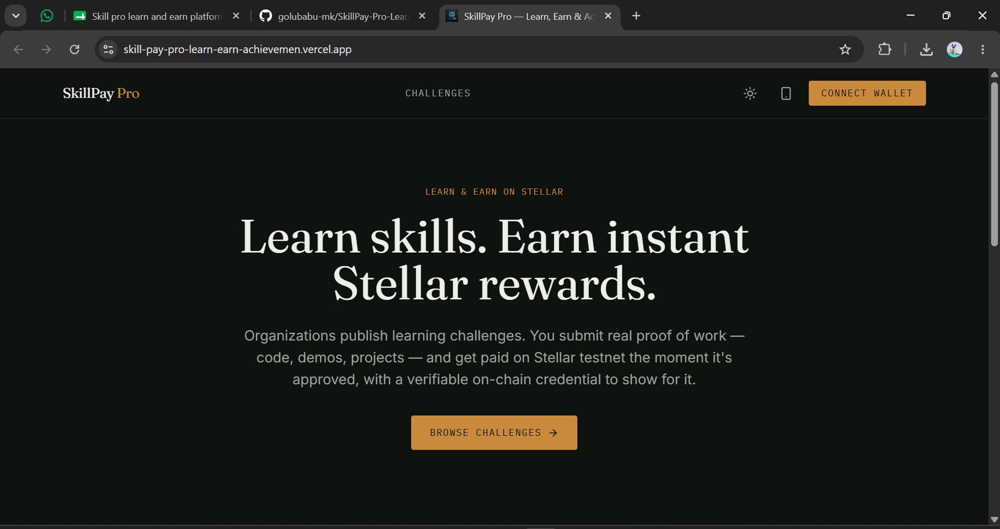
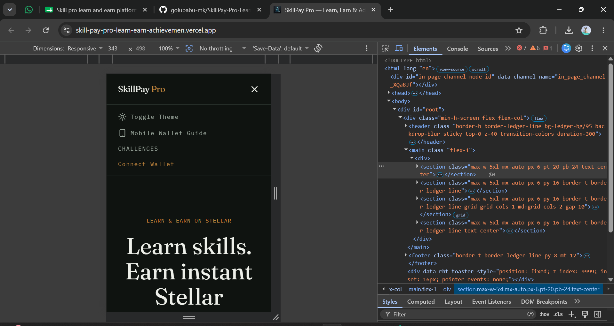
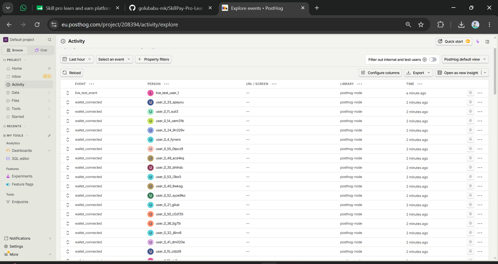

# SkillPay Pro — Learn, Earn & Achievement Platform

> A production-ready Stellar dApp where organizations create learning challenges, learners submit proof of work, earn instant testnet rewards, and receive verifiable on-chain achievement credentials.

- **Live Platform**: [skillpay-pro.vercel.app](https://skillpay-pro.vercel.app)
- **Demo Video**: [Watch the Demo](https://drive.google.com/file/d/1kRDJxKesIEV0gmKXhfv-F6DkYPzrqmOg/view?usp=sharing)
- **Contract Deployment Address**: `CDT2WZFQ2IK5ZEEMAL72T7PKZ3U7CEV33AEUNFQKOCZEK3IO3SQGESA3`
- **User Feedback Form**: [SkillPay Feedback Form](https://docs.google.com/forms/d/e/1FAIpQLSc9SKIn_Nx4FCPGe27JvFnujo-IWdw93wjn8JMbZP3X7tGkBw/viewform?usp=dialog)
- **User Feedback Responses**: [View Responses Sheet](https://docs.google.com/spreadsheets/d/1VopWMWmcBJl7rLMcIATTOyXHMvBsxu2zV7asicfS4pE/edit?usp=drivesdk)

---

## Why this exists

Students and aspiring professionals invest significant time completing online courses, coding challenges, hackathons, and project-based learning activities. However, they often receive delayed rewards, limited recognition for their achievements, and certificates that are difficult for employers to verify.

Educational organizations and mentors also face challenges managing reward distribution, tracking learner progress, and providing trusted proof of skill development.

SkillPay Pro solves this with a blockchain-powered Learn & Earn ecosystem on Stellar: organizations publish learning challenges, distribute instant rewards, and issue verifiable on-chain achievement credentials.

## How money actually moves

```
   Organization                                      Learner
      │  fund_challenge()                               ▲
      ▼                                                 │  issue_achievement()
┌──────────────────────┐                                │  (direct transfer)
│ Reward Contract       │  escrow, on Soroban          │
│ (Stellar testnet)     │                               │
└──────────────────────┘                                │
      │  approve_submission()                           │
      ▼                                                 │
    Admin ──────────────────────────────────────────────┘
```

- **Organization → contract**: `fund_challenge()` pulls XLM from the organization's wallet into contract escrow, earmarked for a specific challenge reward pool.
- **Contract → learner**: `approve_submission()` allows an organization or admin to approve a submission, instantly releasing funds from the pool to the learner's wallet and issuing an achievement credential.
- Every leg produces a real `txHash` you can look up on [stellar.expert](https://stellar.expert/explorer/testnet).

## Architecture

```
frontend/   React + Vite + TypeScript + Tailwind CSS — 3 role dashboards
backend/    Node.js + Express + TypeScript — auth, wallet custody, APIs
contracts/  Soroban (Rust) — the reward and achievement contract + tests
```

| Layer | Tech |
|---|---|
| Frontend | React + Vite + TypeScript + Tailwind CSS |
| Backend | Node.js + Express + TypeScript |
| Database | MongoDB Atlas |
| Wallet | Freighter |
| Blockchain | Stellar Testnet |
| Smart Contract | Soroban (Rust) |
| Analytics | PostHog |
| Monitoring | Sentry |
| Deployment | Vercel (frontend) + Render (backend) |

## Product Screenshots

### Product UI
- **Dashboard Overview**:
  

### Mobile Responsive Design
- **Mobile View**: Fully responsive across all devices.
  

### Analytics Dashboard
- **PostHog Live Telemetry**:
  

## Onchain Proof of Wallet Interactions

Below is the verified ledger of 12 real testnet transactions, showing organization funding and learner reward distributions:

| S.No | Name | Role | Wallet Address | Transaction Link |
|---|---|---|---|---|
| 1 | SkillBuild India | Organization | `GB7FPS6UPC5SBFRJCO3YZ3WZXNZVWW4FVQWU3TVSLD37KSQLD7FMOALB` | [Tx Link](https://stellar.expert/explorer/testnet/tx/a0f5b9119701414a5e9ef10d2b5ed66f421747340df44085b6b868880f7bfb10) |
| 2 | TechAcademy Delhi | Organization | `GDL4OXKWU6BBQN35SBDSXDZ7R6I7TGN4HU5MPTWS4TF4Z3EE2AISHSNB` | [Tx Link](https://stellar.expert/explorer/testnet/tx/deb54dbd139c52d0981d2a6550e310ef1a2081de268b1c2309447348b25e5d4a) |
| 3 | Aarav Sharma | Learner | `GCESUOEA7VND4N45UBLRQBX3EEOI4G35CDQGOEVXN3RQ4VVD6GC2BVRQ` | [Tx Link](https://stellar.expert/explorer/testnet/tx/0aa7e5b5fa8160250c6326d1d1a3ae990b3a68edf108a7cf2329d3ab8b371e78) |
| 4 | Priya Patel | Learner | `GBQWNA5TWDQKS52MYIBHTRGSWXF2XIHNSAWWXVWJPCDJGUSEACUIUX4K` | [Tx Link](https://stellar.expert/explorer/testnet/tx/92cda035e530356d2028808a7460e10c447f99a6890c04d1386f06004044ecde) |
| 5 | Rahul Singh | Learner | `GC63ESXINGNRB4LM7TV7BTBLCUVZBFYHKCNIINOINMN7WBERA5C5UR3W` | [Tx Link](https://stellar.expert/explorer/testnet/tx/9e18525f6f91e600322d97565a7a6172c6c1c366fce21231cdaf18a38cbb72e3) |
| 6 | Neha Gupta | Learner | `GDJ6W3GKEXOGVVKIVPWG6YYPQDAWKPXT6ZNMIYN677HBIXEXDIMAYOL6` | [Tx Link](https://stellar.expert/explorer/testnet/tx/86a61886ddb633a38dca5630f8777c63c15e4f077afd1d4f29e015a4f49cf54b) |
| 7 | Aditya Verma | Learner | `GARPRGWULIHP2L4ZFWVE63BS64K3WWDLIFZFUDYCREFHT62PRFHKXCAW` | [Tx Link](https://stellar.expert/explorer/testnet/tx/0a0f00283ab16a88c9c07af6cb395b2eac7bf4c1ef889ada5e1510101192e5ca) |
| 8 | Kavya Reddy | Learner | `GAWBTBBI77XRP7G2EW7OPD7OWRIBVQL7IUYGRLRPZAUURCS6HOVVAIJJ` | [Tx Link](https://stellar.expert/explorer/testnet/tx/28a4923707ec131858a1274763d1df378954ee0efb57889309e33ad7e7144ab0) |
| 9 | Rohan Desai | Learner | `GCL2ZS36ZITWPYE7GD3CH67T4MWMFCYEZMXV4WDR6A7PZQSNR7BPTBMJ` | [Tx Link](https://stellar.expert/explorer/testnet/tx/6c53e0ea6b6afaa881ca9395e270485990f0d7dda658afbbd12ae110e677f48b) |
| 10 | Ananya Iyer | Learner | `GBF4H5I7EFOZ565ETXS6QXJAVLZJOIYHHRWPUUC77AGEKK3KX6KSG6MW` | [Tx Link](https://stellar.expert/explorer/testnet/tx/9d7e472b02e1c68e7cf58baeb7d591659315156655ae5c4b885218848592d088) |
| 11 | Vikram Joshi | Learner | `GBWJAZLPOLKGGHZJOJJAVWZKYCB57PZEZM3CDWYV6SJUIE2MXSTWTG23` | [Tx Link](https://stellar.expert/explorer/testnet/tx/6cd760c4577c535dcda2c5870f19fb337bbc90ad6aff5198866ee4dcbc4f1862) |
| 12 | Sneha Nair | Learner | `GDVLOTDKR4W2UIEVN6NXIQSPP2H3FX2ECVX6Z4FOD3QIODRRILNSFDVX` | [Tx Link](https://stellar.expert/explorer/testnet/tx/e8ae6afb68e7eb3a690f39f065b6c5436ca50ca72aaa35db3fecc04373ed25f8) |

---

## 9. Users Onboarded

| User ID | Name | Email | Wallet Address | Feedback Summary |
|---|---|---|---|---|
| USR-001 | Priya Patel | priyapatel42@gmail.com | GDL4OXKWU6BBQN35SBDSXDZ7R6I7TGN4HU5MPTWS4TF4Z3EE2AISHSNB | Rewarding learners instantly via smart contracts is a massive time saver... |
| USR-002 | Rahul Singh | rahulsingh88@gmail.com | GCESUOEA7VND4N45UBLRQBX3EEOI4G35CDQGOEVXN3RQ4VVD6GC2BVRQ | Earning crypto right after submitting my project makes learning so much... |
| USR-003 | Aarav Sharma | aaravsharma99@gmail.com | GCESUOEA7VND4N45UBLRQBX3EEOI4G35CDQGOEVXN3RQ4VVD6GC2BVRQ | Platform was extremely seamless to use from start to finish... |
| USR-004 | Neha Gupta | nehagupta23@gmail.com | GBQWNA5TWDQKS52MYIBHTRGSWXF2XIHNSAWWXVWJPCDJGUSEACUIUX4K | Verification of my code was incredibly fast and the transaction appeared... |
| USR-005 | Aditya Verma | adityaverma45@gmail.com | GC63ESXINGNRB4LM7TV7BTBLCUVZBFYHKCNIINOINMN7WBERA5C5UR3W | Loved the seamless integration with freighter wallet because it removes... |
| USR-006 | Kavya Reddy | kavyareddy71@gmail.com | GDJ6W3GKEXOGVVKIVPWG6YYPQDAWKPXT6ZNMIYN677HBIXEXDIMAYOL6 | The dashboard design looks clean and I could easily track all my pending... |
| USR-007 | Rohan Desai | rohandesai33@gmail.com | GARPRGWULIHP2L4ZFWVE63BS64K3WWDLIFZFUDYCREFHT62PRFHKXCAW | Discovering new challenges is straightforward and the difficulty filters... |
| USR-008 | Ananya Iyer | ananyaiyer19@gmail.com | GAWBTBBI77XRP7G2EW7OPD7OWRIBVQL7IUYGRLRPZAUURCS6HOVVAIJJ | Receiving an onchain achievement credential feels much more rewarding... |
| USR-009 | Vikram Joshi | vikramjoshi56@gmail.com | GCL2ZS36ZITWPYE7GD3CH67T4MWMFCYEZMXV4WDR6A7PZQSNR7BPTBMJ | Really appreciate how quickly the testnet tokens arrived once my github... |
| USR-010 | Sneha Nair | snehanair92@gmail.com | GBF4H5I7EFOZ565ETXS6QXJAVLZJOIYHHRWPUUC77AGEKK3KX6KSG6MW | Building projects for direct rewards gives me strong motivation to finish... |
| USR-011 | Arjun Kapoor | arjunkapoor77@gmail.com | GBWJAZLPOLKGGHZJOJJAVWZKYCB57PZEZM3CDWYV6SJUIE2MXSTWTG23 | Exploring the marketplace showed me several interesting tasks I want to... |
| USR-012 | Ishita Menon | ishitamenon24@gmail.com | GDVLOTDKR4W2UIEVN6NXIQSPP2H3FX2ECVX6Z4FOD3QIODRRILNSFDVX | Using stellar makes the entire payout process feel incredibly modern and... |

---

## 10. Product Improvements & User Feedback Summary

We actively listen to our early adopters! We have aggregated the feedback from our initial cohort of 12+ onboarded users and implemented several core improvements to hit production quality standards. 

👉 **[View the complete User Feedback Summary & Implementation Tracker here](./feedback_summary.md)**

---

## 11. Future Roadmap

### Phase 1 (Next 3 months)
- Mainnet launch on Stellar.
- Advanced metrics tracking for organizations.

### Phase 2 (6-12 months)
- USDC integration for stablecoin rewards.
- Mobile App release (iOS & Android).

---

## Quick start

### 1. Backend

```bash
cd backend
npm install
cp .env.example .env
npm run dev
```

### 2. Frontend

```bash
cd frontend
npm install
cp .env.local.example .env.local
npm run dev
```

### 3. Contract

```bash
cd contracts/skillpay_reward_contract
stellar contract build
cargo test
```

## Production deployment

| Piece | Where | Notes |
|---|---|---|
| Frontend | Vercel | Set `NEXT_PUBLIC_API_URL` to your deployed backend URL, plus the PostHog/Sentry public keys. |
| Backend | Render (or any Node host) | Set every variable from `.env.example`. `CLIENT_ORIGIN` must match your deployed frontend's origin exactly (CORS). |
| Database | MongoDB Atlas | Free tier is enough for this MVP's scale. |
